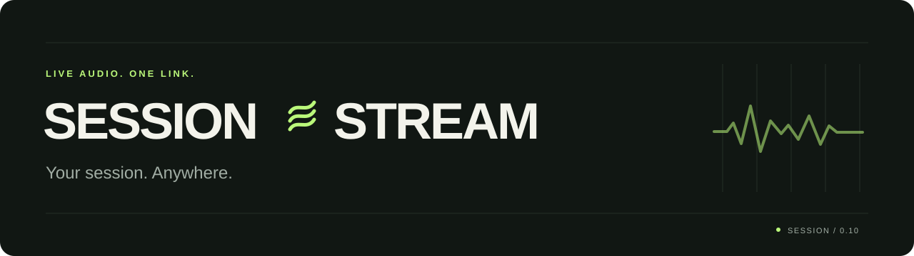
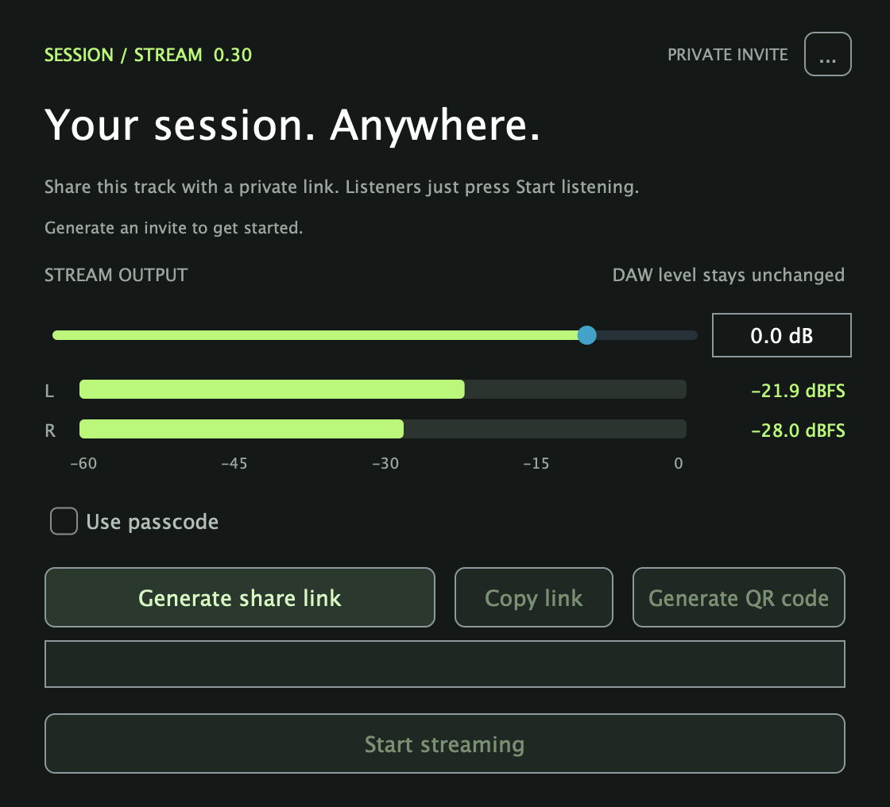
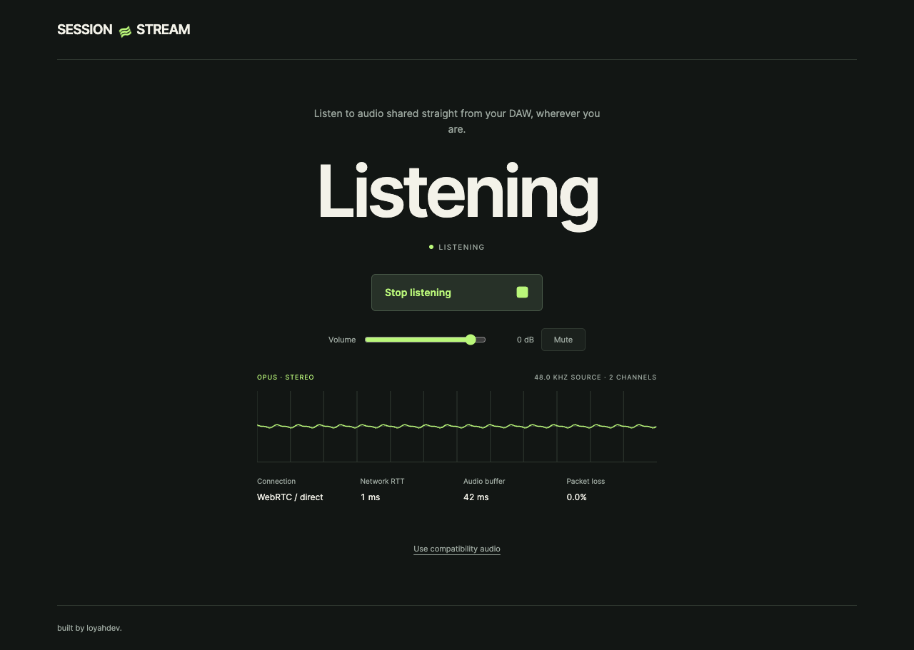

<p align="center">
  
</p>

<h3 align="center">Your DAW. Their browser. One link.</h3>

<p align="center">
  Share live stereo audio from your session with clients, collaborators, and students.<br>
  <strong>Free and open source. No listener account, plugin, or download.</strong>
</p>

<p align="center">
  
  
  
  <a href="LICENSE"></a>
</p>

<p align="center">
  <a href="#quick-start"><strong>Get started</strong></a> ·
  <a href="docs/DEVELOPMENT.md">Installation &amp; development</a> ·
  <a href="docs/VALIDATION.md">Validation</a> ·
  <a href="https://github.com/loyahdev/sessionstream/releases">Releases</a>
</p>

---

SessionStream is a VST3 and Audio Units (AU) plugin for producers who teach, collaborate, or work on mixes remotely. Let someone hear changes as you make them, get feedback without another export, or check your mix on another device.

<table>
  <tr>
    <td width="50%" valign="top">
      <h3>Share from your session</h3>
      <p>Generate an invite, control the outgoing level, and watch your stereo meters. Your DAW level stays unchanged.</p>
      <a href="docs/images/plugin.png"></a>
    </td>
    <td width="50%" valign="top">
      <h3>Listen from anywhere</h3>
      <p>Open the link and press Start listening. A live waveform, volume control, and connection details are right there.</p>
      <a href="docs/images/listener.png"></a>
    </td>
  </tr>
</table>

## Made for the feedback loop

| | What you get |
| :--- | :--- |
| **Live stereo** | Low-delay WebRTC audio with stereo Opus at a requested 320 kbps / 48 kHz. |
| **Independent stream gain** | Adjust what your listener hears without changing your track or master level. |
| **Simple invitations** | Share a private link with up to eight listeners. Generate a new invitation to invalidate the previous one. |
| **Browser playback** | Listeners install nothing. They get a waveform, volume control, and live audio and connection details. |
| **Compatibility audio** | Automatic PCM fallback through the HTTPS tunnel when a direct WebRTC connection cannot be established. |
| **Bundled engine** | The streaming engine and tunnel ship with the plugin. No separate Node install, Cloudflare login, or SessionStream subscription. |

## Quick start

**Current build: 0.10 · Apple Silicon · macOS 13.5+ · VST3 + AU**

Install `SessionStream-0.10-mac-arm64.pkg` and reopen your DAW. See [Releases](https://github.com/loyahdev/sessionstream/releases) for published installers, or [build from source](#build-from-source). Local builds place the installer in `artifacts/`.

1. **Add the plugin.** Put SessionStream on the track you want to share, or last on your Main/Master bus for the full mix.
2. **Generate a link.** Click **Generate share link** and wait for it to become ready. First startup can take tens of seconds.
3. **Start streaming.** Adjust **Stream output**, click **Start streaming**, and share the invite using **Copy link**.
4. **Let them listen.** Your listener opens the link and presses **Start listening**.

Click **Stop streaming** to silence listeners; the same invite works when you start again. Keep your Mac awake and online. Anyone with the full invite can listen, so share it with your intended listeners.

### DAW compatibility

| DAW | Plugin format |
| :--- | :--- |
| Ableton Live | VST3 or AU |
| Logic Pro | AU |
| FL Studio | VST3 or AU |
| Other compatible hosts | VST3 or AU |

Run your DAW natively on Apple Silicon. These are format-compatible hosts; host-specific testing is documented in [validation results](docs/VALIDATION.md).

<details>
<summary><strong>Installation and macOS approval</strong></summary>

Save and close your DAW before installing or updating. The installer places the plugins and their bundled runtime in:

- VST3: `~/Library/Audio/Plug-Ins/VST3/SessionStream.vst3`
- AU: `~/Library/Audio/Plug-Ins/Components/SessionStream.component`

Reopen your DAW and rescan plugins if needed. This build is ad-hoc signed; the installer is unsigned and not notarized. Downloaded copies may require **System Settings → Privacy & Security → Open Anyway**.

See the [installation guide](docs/DEVELOPMENT.md#install) for details.

</details>

## How it works

```text
Your DAW → SessionStream → WebRTC stereo audio → Their browser
                │
                └── Temporary HTTPS invite via Cloudflare Quick Tunnel
```

The plugin sends a copy of your audio while your DAW signal passes through unchanged. WebRTC attempts direct audio delivery; compatibility mode sends PCM through the tunnel when needed. Streaming starts off when a saved project opens, and offline exports are never transmitted.

<details>
<summary><strong>Audio quality and connection limits</strong></summary>

The default Opus stream is high-quality compressed audio. Supported DAW source rates are 44.1, 48, 88.2, 96, 176.4, and 192 kHz; WebRTC audio uses 48 kHz. Latency depends on sender buffering, both connections, and listener buffering.

Compatibility mode uses more bandwidth and usually adds delay. One plugin owns an active session at a time. End-to-end latency, long sessions, physical Safari/iOS playback, and real client WAN WebRTC connections remain unverified; see the [recorded validation](docs/VALIDATION.md).

See [quality and connections](docs/DEVELOPMENT.md#quality-and-connections) for technical details and optional TURN configuration.

</details>

<details>
<summary><strong>Temporary links and Cloudflare terms</strong></summary>

SessionStream uses [TryCloudflare Quick Tunnels](https://developers.cloudflare.com/tunnel/get-started/quick-tunnels/) to expose its listener page and connection signaling through a temporary `trycloudflare.com` address. No Cloudflare account or domain is needed.

The address changes when a new tunnel is created and stops working when the tunnel closes. **Quick Tunnels are for testing and development, with no uptime guarantee.** This build is experimental; dependable production hosting needs a different tunnel or hosting setup.

TryCloudflare use is governed by [Cloudflare's Website and Online Services Terms of Use](https://www.cloudflare.com/website-terms/) and [Privacy Policy](https://www.cloudflare.com/privacypolicy/). Share only audio you have permission to transmit, respect service limits, and avoid unlawful or abusive use. Cloudflare can modify, restrict, or discontinue the service. Review the full terms, including their content-rights provisions; this overview does not replace them.

</details>

## Build from source

Requires Apple Silicon macOS, CMake, Xcode Command Line Tools, npm, and `/opt/homebrew/bin/cloudflared`.

```sh
npm install
npm run build:plugin
npm run install:plugin
npm run build:installer
```

The build downloads JUCE and bundles Node, the native WebRTC addon, and cloudflared, then ad-hoc signs the plugin. The installer is written to `artifacts/SessionStream-0.10-mac-arm64.pkg`.

For build details, tests, and troubleshooting, see [development notes](docs/DEVELOPMENT.md).

## Documentation

| Guide | Contents |
| :--- | :--- |
| [Installation & development](docs/DEVELOPMENT.md) | Setup, plugin controls, listener playback, updates, and source builds |
| [Validation results](docs/VALIDATION.md) | Recorded checks, release checksums, and remaining verification limits |
| [Third-party licenses](docs/THIRD_PARTY.md) | Dependencies and bundled runtime notices |

---

<p align="center">
  Built by <a href="https://github.com/loyahdev"><strong>loyahdev</strong></a> · <a href="LICENSE">AGPL-3.0</a><br>
  <sub>An independent project, unaffiliated with Waves, Audiomovers, or Cloudflare.</sub>
</p>
